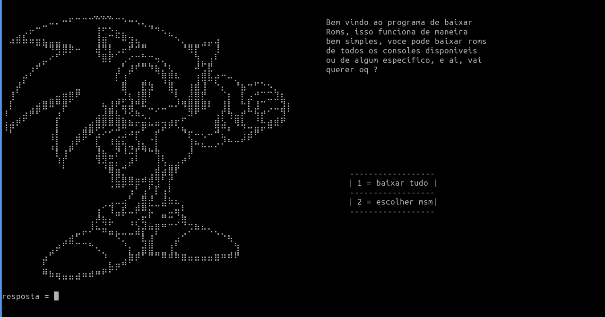
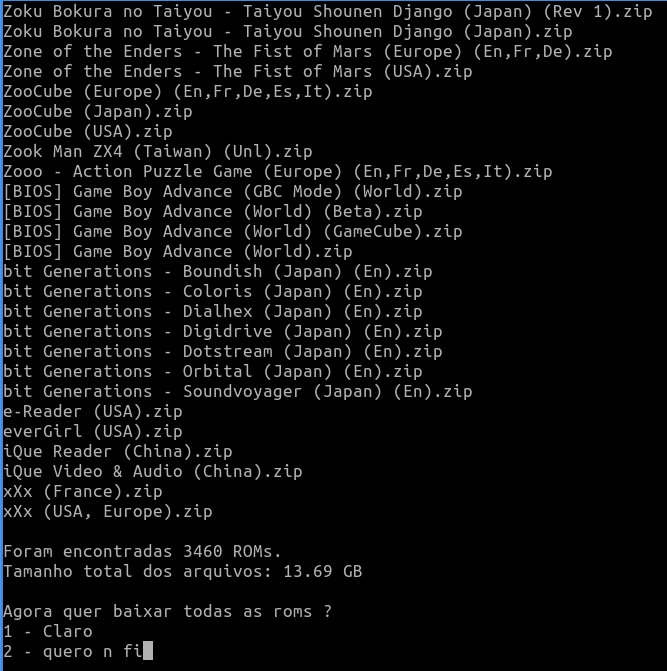

<p align="center">
  
<br>
<a href="#Linux">
<a href="#Windows">
<br>
<a href="https://github.com/sweetbbak"></a>
<br>
</p>

<p align="center">
<a href="#python">
<a href="#linux">
<a href="windows">
</p>

<h3 align="center">
DDroms e a ferramenta perfeita para baixar seus jogos
</h3>

Com o `ddroms` e possivel baixar roms de diversos consoles disponiveis no nosso catalogo, alem de ter um funcionamento simples e eficiente, facilitando a sua vida quando quiser jogar alguns jogos, os arquivos sao pegos da pagina no-intro rom sets(2024) https://archive.org/details/ni-romsets

## Tabela de conteudos

- [Instalacao](#Instalacao)
- [Como usar](#Exemplos)
- [Bugs e mais avisos bacanas](#bugs-e-mais-avisos-bacanas)

## Instalacao

Primeiro de tudo certifique-se de ter a versao mais recente do python instalada em sua maquina, baixe pelo site oficial do python:

```sh
https://www.python.org/downloads/
```

Apos isso baixe o arquivo zip na pagina de `realeses`:

<a href="https://github.com/rennyson10oa/ddroms/releases">Pagina de releases</a>

 
Quando baixar, apenas desconpacte o arquivo zip e dentro da pasta extraida tera dois arquivos: `ddroms.py, requirements.txt`

abra um terminal nessa pasta e siga as instrucoes de acordo com seu sistema operacional:

`Windows`

```sh
pip install requirements.txt
python ddroms.py
```

`Linux`

```sh
pip3 install requirements.txt
python3 ddroms.py
```
Na realidade o primeiro comando e apenas para baixar as bibliotecas e o segundo e para rodar o programa em si

## Exemplos

Dentro da tela do app vc sera apresentado a 2 opcoes, na primeira voce ira baixar TODAS as roms de TODOS os consoles disponiveis, e na segunda podera escolhar um console especifico, caso escolha a 1 opcao esteja preparado para ter uma grande quantidade de espaco do seu pc tomada, alem de esse processo demorar bastante.



caso escolha a segunda opcao, lhe sera mostrado uma lista de todos os consoles, e voce deve digitar o numero correspondete ao console escolhido


dica: `caso queira rolar para cima no windows ou linux usando as teclas do teclado, segure shift + seta pra cima ou seta para baixo :)`

apos escolher o console voce podera escolher uma das 4 opcoes abaixo, onde:

`1 - voce baixa tudo desse console, simples assim`

`2 - voce ve as roms que o console oferece e decide se quer baixa-las`

`3 - escolhe outro console`

`4 - e possivel baixar uma porcentagem do total de roms, por exemplo, se uma console tem 70 mb no total de roms voce pode baixar apenas 20% disso, ou 50%, 2%, voce decide`


tambem e possivel ver quanto GB/MB um console tem:



> [!AVISO]\
> atualmente eu ainda estou desenvolvendo essa bagaca(sozinho), entao podem acontecer bugs e outras
> coisas estranhas que eu vou listar aqui em baixo, alem de que no futuro tenho
> o desejo de adicionar outras funcoes, como buscar roms de jogos especificos, ou
> recomendar alguns emuladores de outras plataformas, ou ate baixar tais emuladores no seu
> pc de forma automatica

## bugs e mais avisos bacanas

como disse antes eu estou desenvolvendo isso sozinho, entao obvio que alguns bugs podem ocorrer, e se ocorrerem seria de grande ajuda se voce me mandar uma mensagem avisando sobre isso.

nao tenho nenhum servidor onde eu poderia estar hospedando essas roms, e atualmente esse programa faz web scrapping da pagina do archive.org, essa pagina em si e um pouco lenta, entao coisas como: downloads falhando e demora para baixar alguma rom pode ser recorrente.

outra coisa interessante de se lembrar e que no meio dessas roms tem algumas bios, entao ao baixar as roms de algum console voce leva de brinde as bios (mas nao posso garantir que elas funcionam, ja que nem eu testei todas)